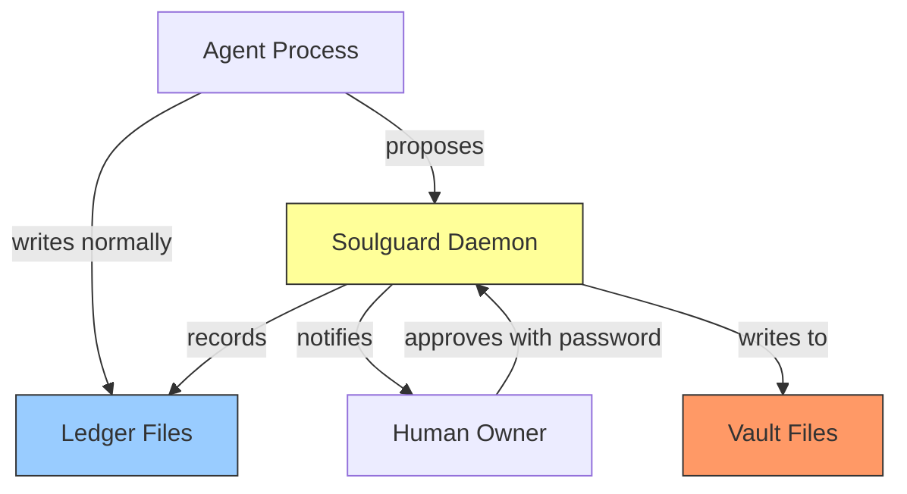

# Soulguard

_Identity protection for AI agents._

Soulguard allows configuring fine-grained identity protections around AI agents (e.g. OpenClaw) - even under prompt injection. It uses OS-level file permissions as the hard security floor, with optional framework plugins for better UX.

## The Problem

AI agents read identity files (SOUL.md, AGENTS.md, config) on every session. If a prompt injection compromises the agent, it can rewrite these files — persistently changing the agent's personality, values, and behavior across all future sessions.

## The Approach

**Two tiers:**

- **Vault 🔒** — Vaulted files cannot be modified except with owner approval (enforced by OS level permissions). Recommended default for `SOUL.md`, `AGENTS.md`, etc.

- **Ledger 📒** — Files the agent may modify freely, but generates change records for asynchronous review (or automated monitoring). Recommended default for agent memory files.

**Two enforcement layers:**

1. OS file permissions (hard floor — works without any framework integration)
2. Framework plugin (UX layer — helpful errors, tool interception, cron gating)

**Owner approval via password** — argon2 hashed, entered via CLI or web UI, never accessible to the agent.

See [DESIGN.md](DESIGN.md) for the full threat model, architecture, and design decisions.

## Quick Start

```bash
# Install
npm install -g soulguard

# Initialize (one-time, requires sudo)
sudo soulguard init ~/my-agent-workspace

# The agent proposes changes, using the OpenClaw tool, or the CLI:
soulguard propose

# The owner approves, using the cli or the web client
soulguard approve <proposal-id>
```

## Packages

| Package                                   | Description                                      |
| ----------------------------------------- | ------------------------------------------------ |
| [@soulguard/core](packages/core/)         | Daemon, vault, ledger, proposals, approvals, CLI |
| [@soulguard/web](packages/web/)           | Web-based approval server                        |
| [@soulguard/openclaw](packages/openclaw/) | OpenClaw framework plugin                        |

## How It Works



Vault files are physically unwritable by the agent
(OS permissions). The daemon is the only process
that can modify them, and only after owner approval.

Ledger files are agent-writable but every change is
recorded. The owner reviews async and can revert.

## Links

- **Design doc:** [DESIGN.md](DESIGN.md)
- **Website:** [soulguard.ai](https://soulguard.ai)
- **GitHub:** [mirascope/soulguard](https://github.com/mirascope/soulguard)

## License

MIT

---

\*Built with love ❤️  by [Mirascope](https://mirascope.com).
